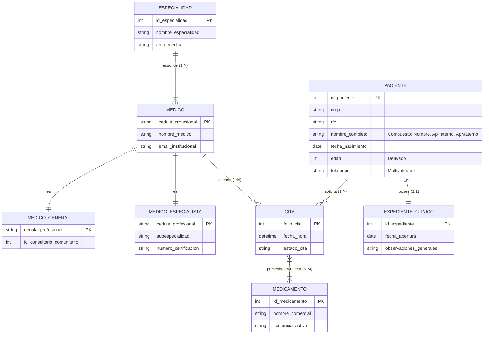

Hola

```mermaid
erDiagram
    PACIENTE {
        int id_paciente PK
        string curp
        string rfc
        string nombre_completo "Compuesto: Nombre, ApPaterno, ApMaterno"
        date fecha_nacimiento
        int edad "Derivado"
        string telefonos "Multivalorado"
    }

    ESPECIALIDAD {
        int id_especialidad PK
        string nombre_especialidad
        string area_medica
    }

    MEDICO {
        string cedula_profesional PK
        string nombre_medico
        string email_institucional
    }

    MEDICO_GENERAL {
        string cedula_profesional PK
        int id_consultorio_comunitario
    }

    MEDICO_ESPECIALISTA {
        string cedula_profesional PK
        string subespecialidad
        string numero_certificacion
    }

    CITA {
        int folio_cita PK
        datetime fecha_hora
        string estado_cita
    }

    EXPEDIENTE_CLINICO {
        int id_expediente PK
        date fecha_apertura
        string observaciones_generales
    }

    MEDICAMENTO {
        int id_medicamento PK
        string nombre_comercial
        string sustancia_activa
    }

    %% Relaciones y Cardinalidades
    ESPECIALIDAD ||--|{ MEDICO : "adscribe (1:N)"
    PACIENTE ||--o{ CITA : "solicita (1:N)"
    MEDICO ||--o{ CITA : "atiende (1:N)"
    PACIENTE ||--|| EXPEDIENTE_CLINICO : "posee (1:1)"
    CITA }|--|{ MEDICAMENTO : "prescribe en receta (N:M)"

    %% Jerarquía E-RE (Especialización)
    MEDICO ||--|| MEDICO_GENERAL : "es"
    MEDICO ||--|| MEDICO_ESPECIALISTA : "es"

```
