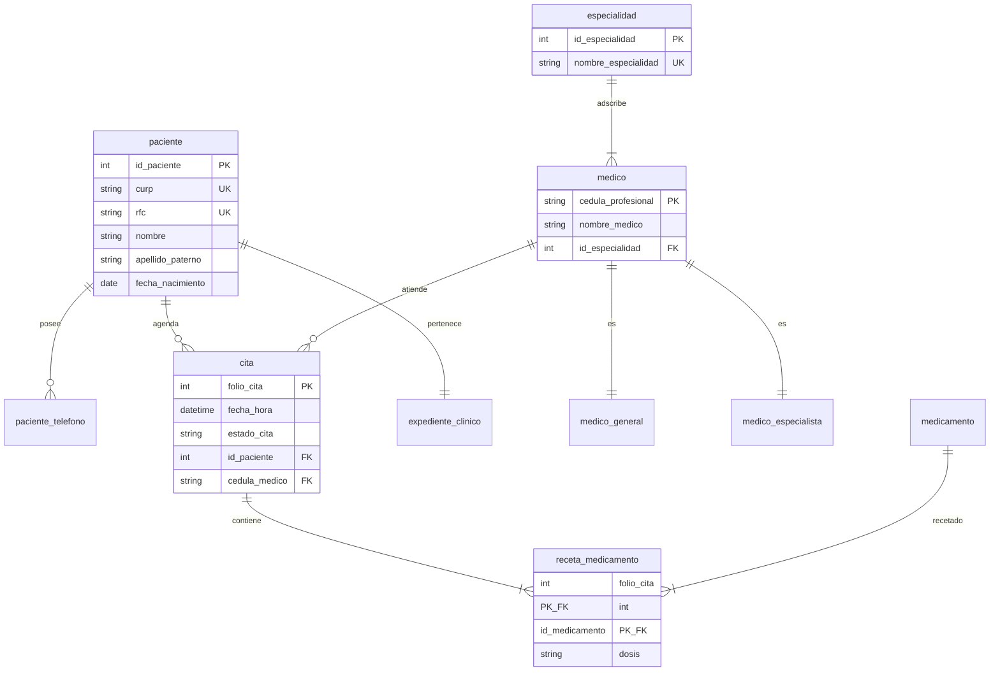

```mermaid
erDiagram
    paciente ||--o{ paciente_telefono : posee
    especialidad ||--|{ medico : adscribe
    paciente ||--o{ cita : agenda
    medico ||--o{ cita : atiende
    paciente ||--|| expediente_clinico : pertenece
    medico ||--|| medico_general : es
    medico ||--|| medico_especialista : es
    cita ||--|{ receta_medicamento : contiene
    medicamento ||--|{ receta_medicamento : recetado

    paciente {
        int id_paciente PK
        string curp UK
        string rfc UK
        string nombre
        string apellido_paterno
        date fecha_nacimiento
    }

    especialidad {
        int id_especialidad PK
        string nombre_especialidad UK
    }

    medico {
        string cedula_profesional PK
        string nombre_medico
        int id_especialidad FK
    }

    cita {
        int folio_cita PK
        datetime fecha_hora
        string estado_cita
        int id_paciente FK
        string cedula_medico FK
    }

    receta_medicamento {
        int folio_cita PK_FK
        int id_medicamento PK_FK
        string dosis
    }

```
